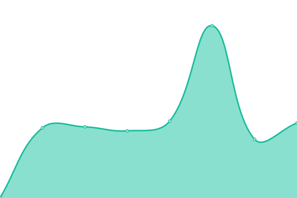
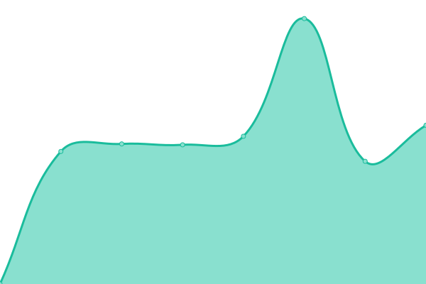

# [📈 Live Status](https://pbrainbiz.github.io/upptime): <!--live status--> **🟩 All systems operational**

This repository contains the open-source uptime monitor and status page for [pbrainbiz](https://pbrainbiz.github.io/upptime), powered by [Upptime](https://github.com/upptime/upptime).

With [Upptime](https://upptime.js.org), you can get your own unlimited and free uptime monitor and status page, powered entirely by a GitHub repository. We use [Issues](https://github.com/pbrainbiz/upptime/issues) as incident reports, [Actions](https://github.com/pbrainbiz/upptime/actions) as uptime monitors, and [Pages](https://pbrainbiz.github.io/upptime) for the status page.

<!--start: status pages-->
<!-- This summary is generated by Upptime (https://github.com/upptime/upptime) -->
<!-- Do not edit this manually, your changes will be overwritten -->
<!-- prettier-ignore -->
| URL | Status | History | Response Time | Uptime |
| --- | ------ | ------- | ------------- | ------ |
|  [PBrain landing](https://www.pbrain.biz) | 🟩 Up | [p-brain-landing.yml](https://github.com/pbrainbiz/upptime/commits/HEAD/history/p-brain-landing.yml) | 

 985ms
     
 | 

<a href="https://pbrainbiz.github.io/upptime/history/p-brain-landing">100.00%</a>
    

|  [PBrain tenant](https://www.pbrain.biz/pbrain) | 🟩 Up | [p-brain-tenant.yml](https://github.com/pbrainbiz/upptime/commits/HEAD/history/p-brain-tenant.yml) | 

 452ms
     
 | 

<a href="https://pbrainbiz.github.io/upptime/history/p-brain-tenant">100.00%</a>
    

|  [PBrain demo](https://demo.pbrain.biz) | 🟩 Up | [p-brain-demo.yml](https://github.com/pbrainbiz/upptime/commits/HEAD/history/p-brain-demo.yml) | 

 831ms
     
 | 

<a href="https://pbrainbiz.github.io/upptime/history/p-brain-demo">100.00%</a>
    

|  [PBrain experience](https://experience.pbrain.biz/panasonic/na-s106fr1bs) | 🟩 Up | [p-brain-experience.yml](https://github.com/pbrainbiz/upptime/commits/HEAD/history/p-brain-experience.yml) | 

 933ms
     
 | 

<a href="https://pbrainbiz.github.io/upptime/history/p-brain-experience">100.00%</a>
    

|  [PBrain web channel](https://www.pbrain.biz/chatbot/channelweb?id=52-107&index=0) | 🟩 Up | [p-brain-web-channel.yml](https://github.com/pbrainbiz/upptime/commits/HEAD/history/p-brain-web-channel.yml) | 

 577ms
     
 | 

<a href="https://pbrainbiz.github.io/upptime/history/p-brain-web-channel">100.00%</a>
    

|  [PBrain CN landing](https://www.pbraindemo.cn) | 🟩 Up | [p-brain-cn-landing.yml](https://github.com/pbrainbiz/upptime/commits/HEAD/history/p-brain-cn-landing.yml) | 

 5135ms
     
 | 

<a href="https://pbrainbiz.github.io/upptime/history/p-brain-cn-landing">99.09%</a>
    

|  [PBrain CN tenant](https://www.pbraindemo.cn/xiaomi-airpurifier) | 🟩 Up | [p-brain-cn-tenant.yml](https://github.com/pbrainbiz/upptime/commits/HEAD/history/p-brain-cn-tenant.yml) | 

 583ms
     
 | 

<a href="https://pbrainbiz.github.io/upptime/history/p-brain-cn-tenant">100.00%</a>
    

|  [PBrain CN web channel](https://www.pbraindemo.cn/chatbot/channelweb?id=4-68&index=1) | 🟩 Up | [p-brain-cn-web-channel.yml](https://github.com/pbrainbiz/upptime/commits/HEAD/history/p-brain-cn-web-channel.yml) | 

 405ms
     
 | 

<a href="https://pbrainbiz.github.io/upptime/history/p-brain-cn-web-channel">100.00%</a>
    

|  [PBrain system test tenant](https://www.pbrain.appahoo.com/pbrain) | 🟩 Up | [p-brain-system-test-tenant.yml](https://github.com/pbrainbiz/upptime/commits/HEAD/history/p-brain-system-test-tenant.yml) | 

 2168ms
     
 | 

<a href="https://pbrainbiz.github.io/upptime/history/p-brain-system-test-tenant">100.00%</a>
    

|  [PBrain system test web channel](https://www.pbrain.appahoo.com/chatbot/channelweb?id=1-10&index=0) | 🟩 Up | [p-brain-system-test-web-channel.yml](https://github.com/pbrainbiz/upptime/commits/HEAD/history/p-brain-system-test-web-channel.yml) | 

 1505ms
     
 | 

<a href="https://pbrainbiz.github.io/upptime/history/p-brain-system-test-web-channel">100.00%</a>
    

<!--end: status pages-->

[**Visit our status website →**](https://pbrainbiz.github.io/upptime)

## 📄 License

- Powered by: [Upptime](https://github.com/upptime/upptime)
- Code: [MIT](./LICENSE) © [pbrainbiz](https://pbrainbiz.github.io/upptime)
- Data in the `./history` directory: [Open Database License](https://opendatacommons.org/licenses/odbl/1-0/)
